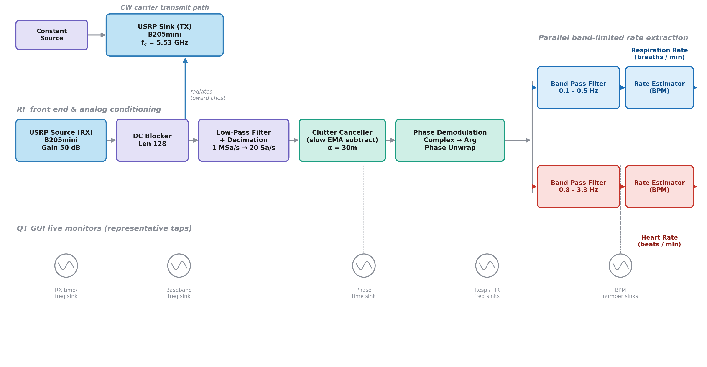

# Heart Rate & Respiration CW Doppler Radar (USRP B205mini)

Contactless heart-rate (HR) and respiration-rate (RR) sensing using a single
Ettus USRP B205mini as a continuous-wave (CW) monostatic Doppler radar, built
in [GNU Radio Companion](https://wiki.gnuradio.org/index.php/GNURadioCompanion) (GRC).

A CW tone is transmitted at 5.53 GHz; the same board receives the reflection.
Tiny chest-wall movement from breathing and heartbeat phase-modulates the
reflected tone. The flowgraph demodulates that phase, splits it into
breathing-band and heartbeat-band signals, and reports both rates live.



## Files

| File | What it is |
|---|---|
| [`heart_resp_radar_b205mini.grc`](heart_resp_radar_b205mini.grc) | The GNU Radio Companion flowgraph — this is the canonical source. Open it in GRC to view/edit the graph. |
| [`heart_resp_radar_b205mini.py`](heart_resp_radar_b205mini.py) | The Python flowgraph, hand-transcribed 1:1 from the `.grc` (see the provenance note at the top of the file for why it wasn't run through `grcc` directly, and how to regenerate it for real). |

## Signal chain

1. **TX**: `analog_const_source_x` (constant complex 1) → `uhd_usrp_sink` — a
   plain CW carrier at 5.53 GHz, gain 40 dB, antenna `TX/RX`.
2. **RX**: `uhd_usrp_source` (5.53 GHz, gain 50 dB, antenna `RX2`) → `dc_blocker_cc`
   (removes the pure-DC leakage component) → `lpf1` (decimate ×1000: 1 Msps → 1 ksps,
   5 kHz cutoff) → `low_pass_filter_0` (5 Hz cutoff, narrows to the
   vital-sign band) → **`clutter_cancel`** (custom block: slow-EMA subtraction
   of residual, slowly-drifting TX→RX leakage that a fixed-length DC blocker
   can't fully remove).
3. **Phase demodulation**: `complex_to_arg` → **`unwrap`** (custom block:
   stateful phase unwrap, continuous across GNU Radio `work()` calls).
4. **Rate-band split** (from the unwrapped phase, decimated again ×50 → ~20 Sps):
   - Respiration: `bpf_resp` band-pass 0.1–0.5 Hz → **`rate_est_resp`** → live
     breaths/min readout.
   - Heart rate: `bpf_hr` band-pass 0.8–3.3 Hz → **`rate_est_hr`** → live
     beats/min readout.
5. **QT GUI**: spectra/scopes at each stage for diagnosis, plus the two live
   numeric BPM readouts and two tunable sliders (`min_amplitude`, `snr_ratio`)
   that gate the rate estimators against false positives.

### The three custom (embedded Python) blocks

- **`clutter_cancel`** — adaptive static-clutter canceller. A monostatic CW
  radar's return is dominated by a large, nearly-static leakage vector; this
  block tracks its slow drift with an exponential moving average and
  subtracts it, so `atan2()` downstream isn't fighting a huge static term.
- **`unwrap`** — continuous phase unwrap (`np.unwrap()` only unwraps within a
  single call; this keeps unwrap state across the whole stream).
- **`rate_est_hr` / `rate_est_resp`** — windowed-FFT peak-rate estimator with
  a three-part validity gate (amplitude, in-band SNR, and frequency
  stability across consecutive windows) so an empty room reports 0 BPM
  instead of chasing colored noise.

Full docstrings for each are in both the `.grc` (as each block's embedded
source) and the `.py`.

## Requirements

- [GNU Radio](https://www.gnuradio.org/) 3.10+ with the `uhd` (Ettus UHD)
  and `qtgui` components
- An Ettus USRP B205mini, connected via USB3

## Running

```bash
# Open and edit the flowgraph:
gnuradio-companion heart_resp_radar_b205mini.grc

# Or run the generated Python directly:
python3 heart_resp_radar_b205mini.py
```

## Tuning

- `min_amplitude` — raise if the empty-room signal is noisy and reads a
  nonzero rate; lower if real breathing/heartbeat isn't being detected.
- `snr_ratio` — raise for fewer false positives (slower lock-on); lower for
  more sensitivity.
- Better TX/RX antenna isolation (physical separation, isolation material)
  reduces the underlying leakage noise and helps both sides of that
  sensitivity/false-positive tradeoff.

## Presented at

GRCon26.
# heart-resp-radar-b205mini
# heart-resp-radar-b205mini
# heart-resp-radar-b205mini
# heart-resp-radar-b205mini
